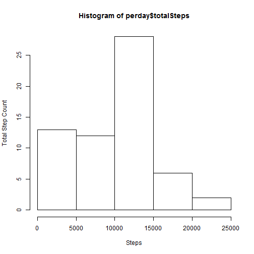
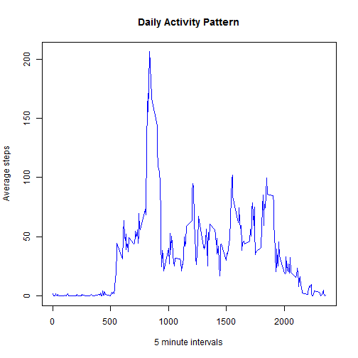
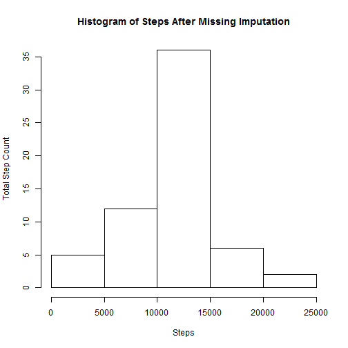
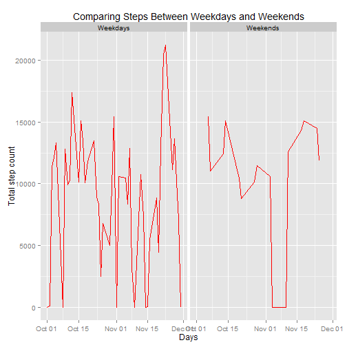

---

---
  ---
  title: "Personal Movement Pattern Analysis"

author: "Simon Geletta"
date: "November 11, 2014"
output: html_document
---
  
  This report explains the pattern of activities of an individual whose activities were recorded using a personal activity monitoring device. This device collects data at 5 minute intervals through out the day. The data consists of two months of data from an anonymous individual collected during the months of October and November, 2012 and include the number of steps taken in 5 minute intervals each day.

###Section 1 Q1: Importing the Data

The first order of business is to read the data from a comma separated file and do some preliminary pre-processing. The following code will do so, and also output summary statistics.


```r
setwd("C:\\Users\\Simon\\Documents\\other\\data science\\ReprodResearch\\data")
actdt<-read.csv("activity.csv")
str(actdt)
```

```
## 'data.frame':	17568 obs. of  3 variables:
##  $ steps   : int  NA NA NA NA NA NA NA NA NA NA ...
##  $ date    : Factor w/ 61 levels "2012-10-01","2012-10-02",..: 1 1 1 1 1 1 1 1 1 1 ...
##  $ interval: int  0 5 10 15 20 25 30 35 40 45 ...
```
###Section 1 Q2: Pre-Processing
As could be seen from the above summary, the "date" field is a "factor". This does need to change to a date field. In addition, a pre-processing step involving "tidying" up the data by creating two summary tables. The first summary table makes "date" the basic (atomic) record. This is important to produce the  daily suumary (daily total and daily average records) statistics. The second creates a table with "interval" as the atomic record. This will provide the 5-minute-interval summary statistics. 
To accomplish these transformations, I will load the data.table library/package


```r
library(data.table)
```

```
## data.table 1.9.4  For help type: ?data.table
## *** NB: by=.EACHI is now explicit. See README to restore previous behaviour.
```

```r
actdt<-data.table(actdt)
perday<-actdt[,list(totalSteps=sum(steps, na.rm=TRUE),
                    averageSteps=mean(steps, na.rm=TRUE)
), by=date]

perinterval<-actdt[,list(totalSteps=sum(steps, na.rm=TRUE),
                         averageSteps=mean(steps,na.rm=TRUE)
), by=interval]

str(perday)
```

```
## Classes 'data.table' and 'data.frame':	61 obs. of  3 variables:
##  $ date        : Factor w/ 61 levels "2012-10-01","2012-10-02",..: 1 2 3 4 5 6 7 8 9 10 ...
##  $ totalSteps  : int  0 126 11352 12116 13294 15420 11015 0 12811 9900 ...
##  $ averageSteps: num  NaN 0.438 39.417 42.069 46.16 ...
##  - attr(*, ".internal.selfref")=<externalptr>
```

```r
str(perinterval)
```

```
## Classes 'data.table' and 'data.frame':	288 obs. of  3 variables:
##  $ interval    : int  0 5 10 15 20 25 30 35 40 45 ...
##  $ totalSteps  : int  91 18 7 8 4 111 28 46 0 78 ...
##  $ averageSteps: num  1.717 0.3396 0.1321 0.1509 0.0755 ...
##  - attr(*, ".internal.selfref")=<externalptr>
```
###Section 2 Describing the data
For this part of the assignment the instruction is to ignore the missing values in the dataset. My report will be based on the pre-processed "daily" total records.

#### Section 2 Q1: Histogram

 

#### Section 2 Q2: Mean and Median steps


```r
actdt[,list(Mean_steps_per_day=mean(steps, na.rm=TRUE), Median_steps_per_day=median(steps, na.rm=TRUE))]
```

```
##    Mean_steps_per_day Median_steps_per_day
## 1:            37.3826                    0
```

###Section 3: What is the average daily activity pattern?
Here is the time series plot of the  5 minute interval (plotted on the x-axis), and the average steps across all days on the y-axis
####Section 3 Q1: Time Series

```r
with(perinterval, plot(interval, averageSteps, type="l", xlab="5 minute intervals", ylab="Average steps", main="Daily Activity Pattern", col="blue"))
```

 

####Section 3 Q2: Which 5 minute interval contains the maximum number of stesp?
To answer this question I will have to go back to the original (raw) data where steps are recorded on a 5-minutes interval basis. Here is the code that will give the correct output:
  

```r
subset(actdt, steps==max(steps, na.rm=TRUE))
```

```
##    steps       date interval
## 1:   806 2012-11-27      615
```

As could be seen from the above R output, 806 steps were taken during the 615th interval which fell on November 27the 2012. That was the highest number of steps taken during any of the 5 minute intervals.

###Imputing missing values

I used the package called "mice" to perform this (it is real easy to use this). You of course need to install the package, after which you could do the following


```r
library(mice)
```

```
## Warning: package 'mice' was built under R version 3.1.2
```

```
## Loading required package: Rcpp
## Loading required package: lattice
## mice 2.22 2014-06-10
```

```r
ac<-mice(actdt,m=1)
```

```
## 
##  iter imp variable
##   1   1  steps
##   2   1  steps
##   3   1  steps
##   4   1  steps
##   5   1  steps
```

```r
compdat<-complete(ac, "long", inc=TRUE)
impdata<-subset(compdat, .imp==1)
impdata<-data.table(impdata)
perday2<-impdata[,list(totalSteps=sum(steps),
                    averageSteps=mean(steps)
), by=date]

perinterval2<-impdata[,list(totalSteps=sum(steps),
                         averageSteps=mean(steps)
), by=interval]
```
The histogram, mean and median after imputation follows:


```r
hist(perday2$totalSteps, xlab="Steps", ylab="Total Step Count", main="Histogram of Steps After Missing Imputation")
```

 

```r
impdata[,list(Mean_steps_per_day=mean(steps), Median_steps_per_day=median(steps))]
```

```
##    Mean_steps_per_day Median_steps_per_day
## 1:            38.1789                    0
```

The results indicate that the after imputation, the distribution of the step counts is a bit more normal. The mean is also raised by a few points, but the median stays the same.

###Are there differences in activity patterns between weekdays and weekends?
To answer this question I will use the original data set and create a factor variable that represents whether the steps are counted during a weekday or during the weekend.


```r
actdt$stepDays<-ifelse(weekdays(as.POSIXct(actdt$date)) %in% c("Saturday", "Sunday"), "Weekends", "Weekdays")
actdt<-data.table(actdt)

perday3<-actdt[,list(totalSteps=sum(steps, na.rm=TRUE),
                    averageSteps=mean(steps, na.rm=TRUE)
), by=list(date, stepDays)]
```

To make a panel plot, I will use ggplot2 since it produces better results.


```r
library(ggplot2)
a<-ggplot(perday3, aes(as.POSIXct(date), totalSteps))
a<- a+ geom_line(colour='red')
a<- a+facet_wrap(~stepDays)
a <- a + xlab("Days") + ylab("Total step count") + ggtitle("Comparing Steps Between Weekdays and Weekends")
a
```

 
